# COMPLETE NEST JS COURSE

## Table of Contents

- [COMPLETE NEST JS COURSE](#complete-nest-js-course)
  - [Table of Contents](#table-of-contents)
  - [Controllers Routing Requests](#controllers-routing-requests)
    - [let's install nest js cli](#lets-install-nest-js-cli)
    - [let's create a new project](#lets-create-a-new-project)
    - [13 - Controllers](#13---controllers)
    - [14 - Resource Controller ✅](#14---resource-controller-)
    - [15 - Route Parameters ✅](#15---route-parameters-)
    - [16 - Request Body🔲](#16---request-body)
    - [17 - Responses and Status Codes🔲](#17---responses-and-status-codes)
    - [18 - Request Payload Data Transfer Objects🔲](#18---request-payload-data-transfer-objects)
    - [19 - The Update Payload🔲](#19---the-update-payload)
    - [20 - A Working API Example🔲](#20---a-working-api-example)
    - [🔲](#)
    - [🔲](#-1)
    - [🔲](#-2)
    - [🔲](#-3)
    - [🔲](#-4)
    - [🔲](#-5)
    - [🔲](#-6)
    - [🔲](#-7)
    - [🔲](#-8)
    - [🔲](#-9)
    - [🔲](#-10)
    - [🔲](#-11)
    - [🔲](#-12)
    - [🔲](#-13)
    - [🔲](#-14)
    - [🔲](#-15)
    - [🔲](#-16)
    - [🔲](#-17)

## Controllers Routing Requests

### let's install nest js cli

```bash
npm i -g @nestjs/cli
```

### let's create a new project

```bash
nest new project-name
```

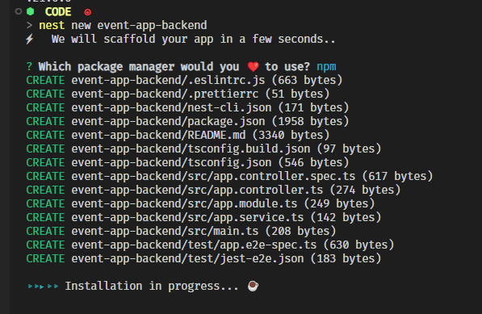

let's create http file for the api calls

```bash
touch API.http
```
add the default route to the http file

```http
GET http://localhost:3000 HTTP/1.1
```


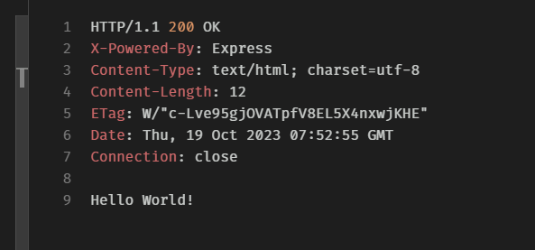

nest js cli link : https://docs.nestjs.com/cli/usages

let's create a sample controller method

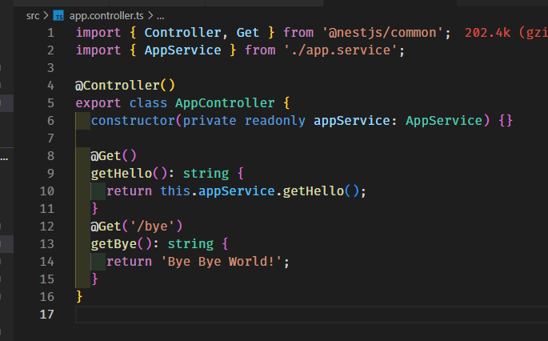

```http
GET http://localhost:3000/bye HTTP/1.1
```

### 13 - Controllers

controller docs https://docs.nestjs.com/controllers

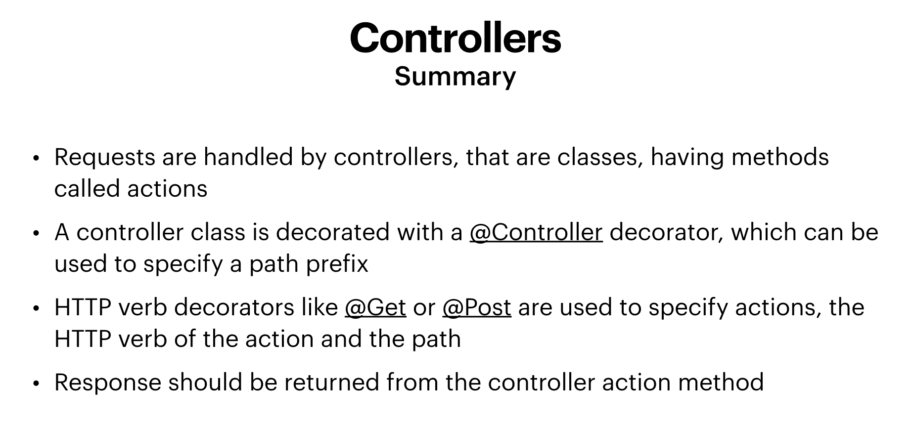


let's create a controller

### 14 - Resource Controller ✅


 Event, User, EventAttendee is a resource

databases are good candidates for resources

each resourse can have multiple operations.

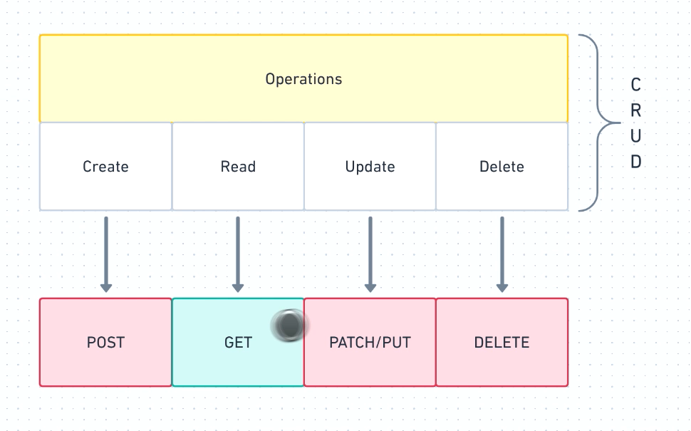
let's create a new controller

```bash
nest g controller events
```
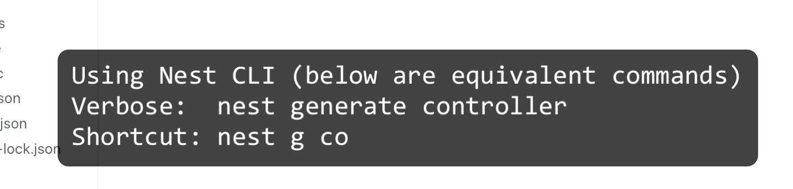


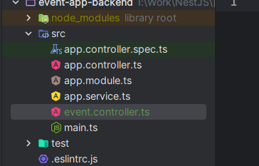

try to keep the controller simple


let's add the controller method
```ts
import { Controller, Get, Post, Patch, Delete } from '@nestjs/common';

@Controller('/event')
export class EventController {
  @Get()
  findAll() {}
  @Get()
  findOne() {}
  @Post()
  create() {}
  @Patch()
  update() {}
  @Delete()
  delete() {}
}

```
let's add the controller to the app module
```ts
import { Module } from '@nestjs/common';
import { AppController } from './app.controller';
import { AppService } from './app.service';
import { EventController } from './event.controller';

@Module({
  imports: [],
  controllers: [AppController, EventController],
  providers: [AppService],
})
export class AppModule {}

```

let's test the apis

```http
### GET EVENT
GET http://localhost:3000/event

### CREATE EVENT
POST http://localhost:3000/event

### DELETE EVENT

DELETE http://localhost:3000/event

### UPDATE EVENT
PATCH http://localhost:3000/event
```

output

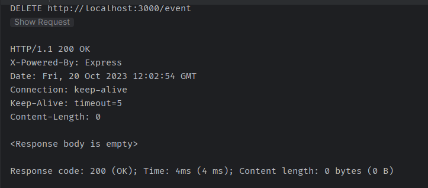

**SUMMERY**

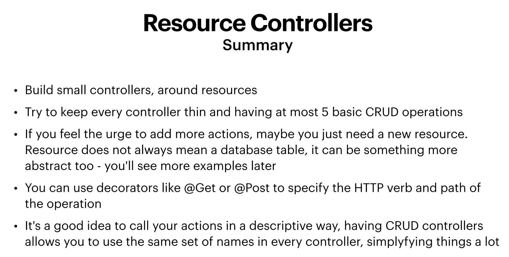


### 15 - Route Parameters ✅


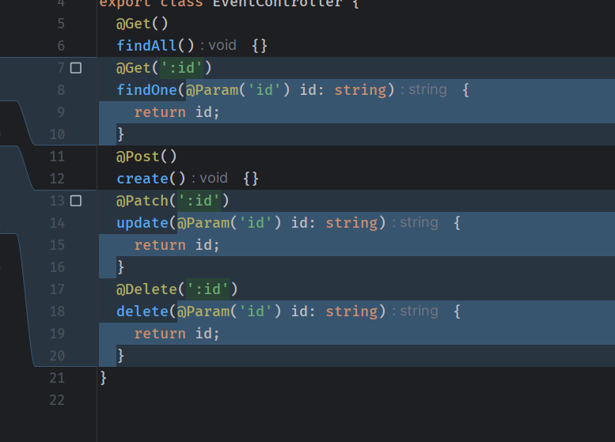
```ts
import { Controller, Get, Post, Patch, Delete, Param } from '@nestjs/common';

@Controller('/event')
export class EventController {
  @Get()
  findAll() {}
  @Get(':id')
  findOne(@Param('id') id: string) {
    return id;
  }
  @Post()
  create() {}
  @Patch(':id')
  update(@Param('id') id: string) {
    return id;
  }
  @Delete(':id')
  delete(@Param('id') id: string) {
    return id;
  }
}

```

**SUMMERY**

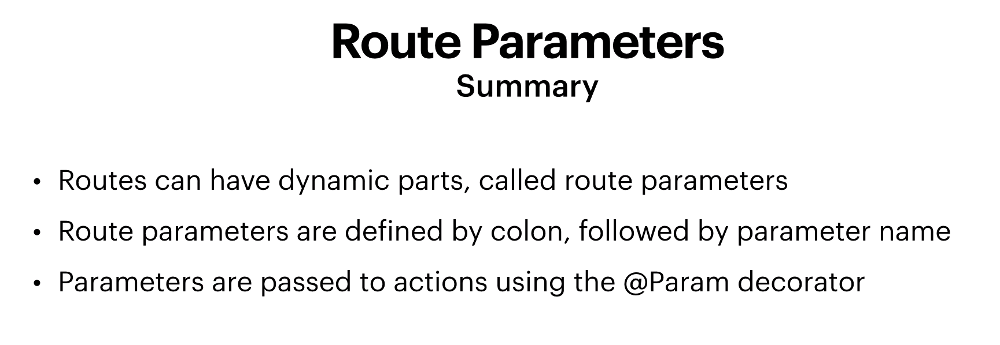
### 16 - Request Body🔲
### 17 - Responses and Status Codes🔲


### 18 - Request Payload Data Transfer Objects🔲
### 19 - The Update Payload🔲
### 20 - A Working API Example🔲


spread operator https://developer.mozilla.org/en-US/docs/Web/JavaScript/Reference/Operators/Spread_syntax


### 🔲
### 🔲
### 🔲
### 🔲
### 🔲
### 🔲
### 🔲
### 🔲
### 🔲
### 🔲
### 🔲
### 🔲
### 🔲
### 🔲
### 🔲
### 🔲
### 🔲
### 🔲